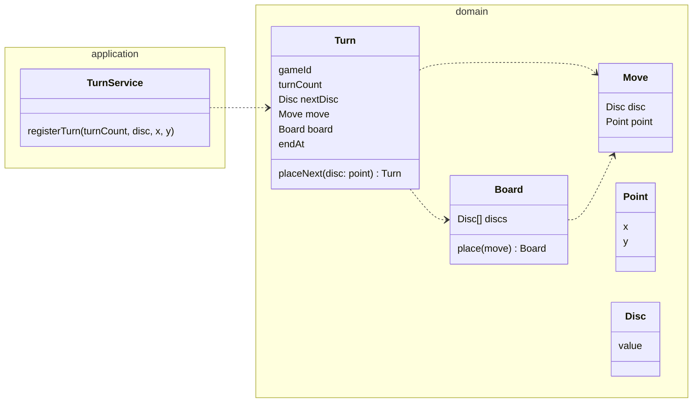

```mermaid
classDiagram
    direction LR

    namespace application{
        class TurnService{
            registerTurn(turnCount, disc, x, y)
        }
    }
    namespace domain{
        class Turn{
            gameId
            turnCount
            Disc nextDisc
            Move move
            Board board
            endAt
            placeNext(disc: point) Turn
        }
        class Move{
            Disc disc
            Point point
        }
        class Board{
            Disc[] discs
            place(move) Board
        }
        class Point{
            x
            y
        }
        class Disc{
            value
        }
    }

    TurnService..>Turn
    Turn..>Move
    Turn..>Board
    Board..>Move
```